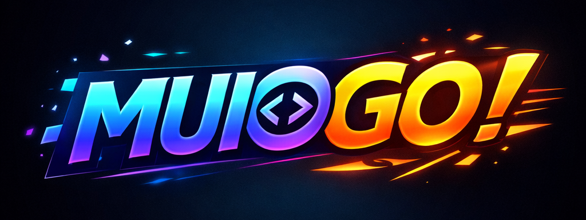

---

<p align="center"></p>

<p></p>

**M**odelling **U**ser **I**nterface for **OG**-Core and **O**SeMOSYS

The United Nations Department of Economic and Social Affairs (DESA) has applied open-source modelling tools during the last decade in more than 20 countries —particularly in Small Island Developing States, Land-Locked Countries, and Least Developed Countries— to support policies related to Nationally Determined Contributions (NDCs), climate adaptation, social protection, and fiscal sustainability:

- CLEWS, built on OSeMOSYS, analyzes interactions and trade-offs across land, energy, and water systems under climate scenarios.
- OG-Core is a dynamic overlapping-generations macroeconomic model that evaluates long-term fiscal, demographic, and economic policies.

By linking sectoral resource systems (climate, land, energy, and water) with a dynamic macroeconomic model, the unified framework will allow policymakers to assess both the physical feasibility and economy-wide impacts of climate and development policies in a transparent, reproducible, and low-cost way.

The project will create a standardized interface and shared execution system linking the two models, enabling integrated analyses that are not currently possible. The enhanced OG-CLEWS framework will be deployed in more than 10 countries, supporting evidence-based policymaking and helping countries advance toward their Sustainable Development Goals through 2030.

See the [Project Background & Vision](https://github.com/EAPD-DRB/MUIOGO/wiki/Project-Background-and-Vision) and the programme's [Timeline](https://github.com/EAPD-DRB/MUIOGO/wiki/Timeline) for more information.

MUIOGO is the integration project to bring the purely Python-based OG-Core model into MUIO, the GUI for OSeMOSYS (CLEWS).

For now, the app will run locally on a user's machine. In the future, the app may be hosted on a server for public access, so scalability should remain a design consideration. Today, the initial target is a downloadable app that users can run locally without needing an internet connection.

At the moment, this repository starts from a direct copy baseline of MUIO. The goal of MUIOGO is to evolve that baseline into an integrated OG-CLEWS model that is maintainable and platform-independent.

## Requirements

- The only prerequisite for installation is **Git**:
  - macOS: `xcode-select --install` or `brew install git`
  - Windows (**PowerShell**): `winget install -e --id Git.Git`
  - Linux: `sudo apt install git` (Debian/Ubuntu) or `sudo dnf install git` (Fedora/RHEL)
  - Or download directly: [git-scm.com](https://git-scm.com/downloads)

## Installation

One command takes you from a clean machine to a running MUIOGO.

### macOS / Linux (in Terminal)

```bash
/bin/bash -c "$(curl -fsSL https://raw.githubusercontent.com/EAPD-DRB/MUIOGO/main/scripts/install.sh)"
```

### Windows (in **PowerShell**)

```powershell
$f = "$env:TEMP\muiogo-install.ps1"; irm https://raw.githubusercontent.com/EAPD-DRB/MUIOGO/main/scripts/install.ps1 -OutFile $f; powershell -ExecutionPolicy Bypass -File $f
```

This installer checks for Git, installs `uv` if needed, provisions a compatible Python version, clones MUIOGO, runs `uv sync` to create the project-local virtual environment and install dependencies, installs the GLPK and CBC solvers, and downloads the demo data.
After the installation, the installer **automatically prompts to start MUIOGO**. To stop the server, press <kbd>Ctrl</kbd>+<kbd>C</kbd> in the terminal.

For additional installation options, including the download-then-run workflow and installer flags, see [scripts/QUICK_INSTALL.md](scripts/QUICK_INSTALL.md).

### Launch MUIOGO

To start MUIOGO again, run the following from the MUIOGO project directory:
**macOS / Linux**

```bash
./scripts/start.sh
```

**Windows (PowerShell)**

```powershell
.\scripts\start.bat
```

## Demo Data

The demo dataset (`CLEWs.Demo.zip`) is hosted as a [GitHub release asset](https://github.com/EAPD-DRB/MUIOGO/releases/tag/demo-data) and downloaded automatically during setup when not already cached locally.

- SHA-256: `db92d380b0448f767c4ba56eea5c79b14bcae8fbf8e05a6a0d92d5345bb742c1`

The installer downloads the demo data by default. The archive is downloaded once, cached in `assets/demo-data/`, and reused on subsequent runs.

One of the core goals of MUIOGO is to become platform independent so separate platform-specific ports are no longer required.

## Repository Layout

- `API/`: Flask backend and run/data endpoints
- `WebAPP/`: frontend assets served by Flask
- `WebAPP/DataStorage/`: model inputs, case data, and run outputs
- `docs/`: project and contributor documentation

## Contributing

Start with:

- [CONTRIBUTING.md](CONTRIBUTING.md)
- [docs/GSoC-2026.md](docs/GSoC-2026.md)
- [SUPPORT.md](SUPPORT.md)
- [docs/ARCHITECTURE.md](docs/ARCHITECTURE.md)
- [docs/DOCS_POLICY.md](docs/DOCS_POLICY.md)

Contribution rule:

- Create (or use) an issue first.
- Work in a feature branch (for example `feature/<issue-number>-short-description`).

Templates:

- [.github/ISSUE_TEMPLATE/](.github/ISSUE_TEMPLATE/)
- [.github/pull_request_template.md](.github/pull_request_template.md)

## Advanced Setup and Packaging

The Quick Install workflow is recommended for most users.

Developers who already have the repository cloned can create or update the project-local environment with:

```bash
uv sync
```

```powershell
# Windows packaging dependencies (PyInstaller build only)
uv pip install -r requirements-build-win.txt
```

## Project Boundaries

This repository is downstream and separately managed from upstream:

- Upstream: `https://github.com/OSeMOSYS/MUIO`
- This repo: `https://github.com/EAPD-DRB/MUIOGO`

Delivery in MUIOGO cannot depend on upstream timelines or release cycles.

## License

Apache License 2.0 (`LICENSE`).
